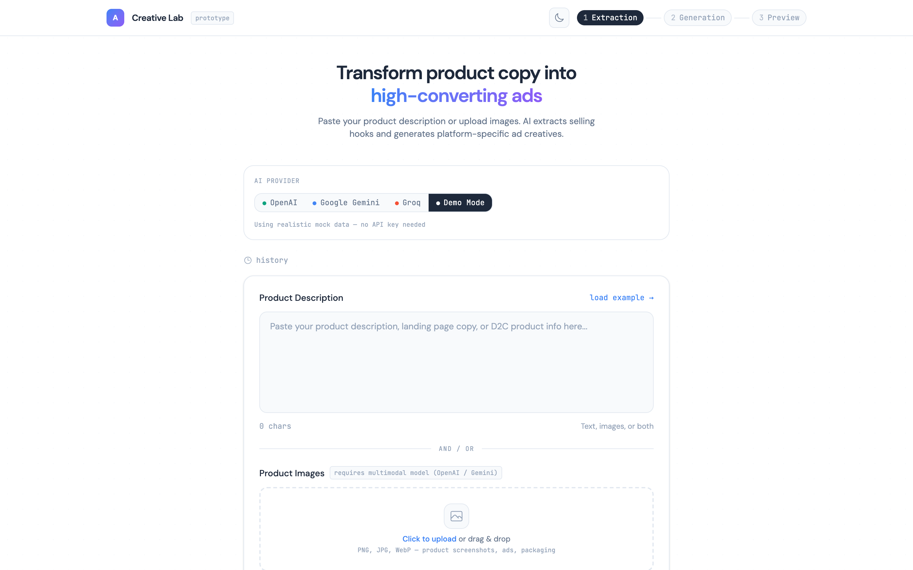
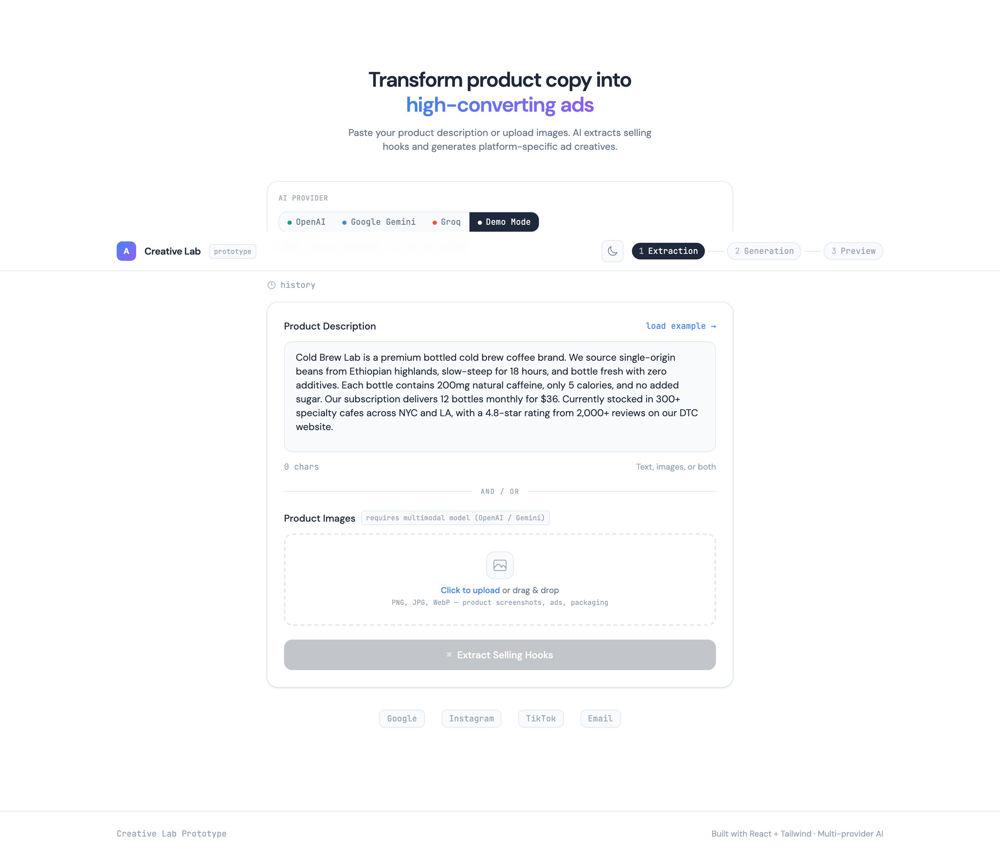
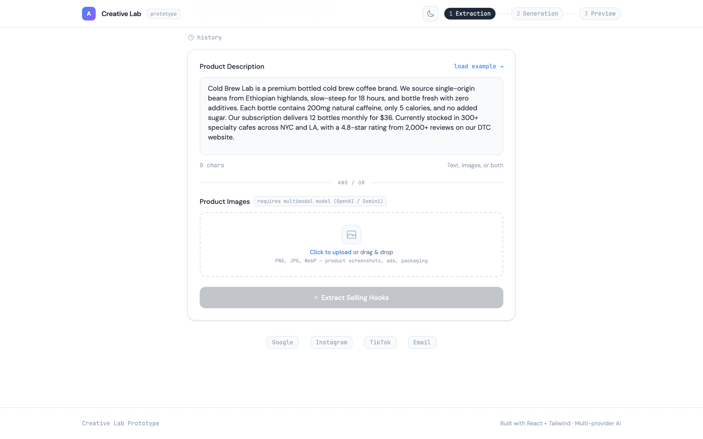
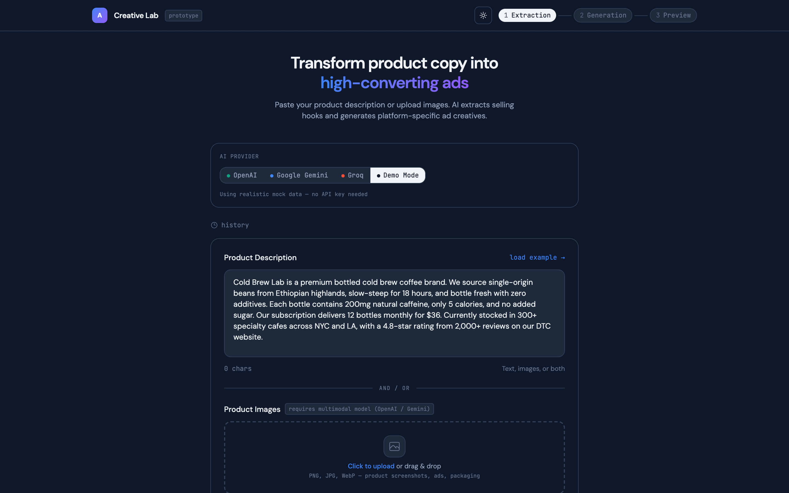

# Creative Lab — AI Ad Generator

[](https://vercel.com/new/clone?repository-url=https://github.com/christinazhang139/creative-lab)
[](https://react.dev)
[](https://tailwindcss.com)
[](LICENSE)

Transform raw product descriptions into high-converting ad creatives across Google, Instagram, TikTok, and Email — powered by AI.

## Demo

### Input — Product Description
> Paste any product description → AI extracts selling hooks



### Phase 1 — Selling Hooks + Structured JSON
> 3 core hooks extracted with different marketing angles



### Phase 2 + 3 — Multi-Channel Ad Preview
> Google Search, Instagram, TikTok, Email — click any hook to refine all channels




### Dark Mode


---

## Features

**AI-Powered Pipeline**
- **Phase 1: Extraction** — AI analyzes product descriptions (and images via multimodal models) to extract 3 core Selling Hooks as structured JSON
- **Phase 2: Multi-Channel Generation** — Generates platform-specific ad variants for Google Search, Instagram, TikTok, and Email
- **Phase 3: Interactive Preview** — Preview cards simulate real platform UIs. Click any hook to **Refine** all 4 channels

**Multi-Provider AI**
- OpenAI GPT-4o mini (with Vision support)
- Google Gemini 2.0 Flash (with Vision support)
- Groq Llama 3.3 70B (fastest inference)
- Demo Mode with realistic mock data (no API key needed)

**Product Features**
- Image upload with drag-and-drop (multimodal analysis)
- Multi-language ad translation (EN / 中文 / 日本語 / Español / 한국어)
- Export results as JSON or copy to clipboard
- Session history with localStorage (last 5 generations)
- Character count validation for Google Ads limits
- Dark mode with system preference detection
- Unsplash stock photo integration for Instagram ad mockups

**Engineering**
- Staggered card entrance animations + hook click pulse effects
- TikTok phone frame storyboards + realistic email inbox UI
- Dynamic Instagram ad visuals (adapts to product category)
- Responsive design (mobile-optimized)
- Containerized with Docker + Nginx
- OpenShift / Kubernetes deployment manifests
- Unit tests with Vitest + GitHub Actions CI

## Quick Start

```bash
npm install
npm run dev
```

Open http://localhost:5173

### With Live AI

Select a provider in the UI (OpenAI, Gemini, or Groq) and paste your API key. No `.env` file needed — keys are used client-side only and never stored.

### Docker

```bash
docker build -t creative-lab .
docker run -p 8080:8080 creative-lab
```

## Deploy

### Vercel (Recommended)

[](https://vercel.com/new/clone?repository-url=https://github.com/christinazhang139/creative-lab)

### OpenShift

```bash
oc login --server=<your-cluster-url>
oc new-project creative-lab
oc apply -f k8s/
oc start-build creative-lab --follow
oc get route creative-lab -o jsonpath='{.spec.host}'
```

## Architecture

```
src/
├── App.jsx                    # Main app — 3-phase step flow
├── lib/
│   ├── ai.js                 # Unified AI interface with mock fallback
│   ├── providers.js           # OpenAI / Gemini / Groq adapters
│   ├── mock-data.js           # Category-aware mock data engine
│   └── storage.js             # localStorage history manager
├── hooks/
│   └── useTypewriter.js       # Typewriter animation hook
└── components/
    ├── ExtractionPanel.jsx    # Text input + image upload
    ├── HooksDisplay.jsx       # Selling hooks with refine interaction
    ├── PreviewCards.jsx       # Platform-specific preview cards
    ├── ProviderSelector.jsx   # AI provider switcher + API key input
    ├── LanguageToggle.jsx     # Multi-language ad translation
    ├── ExportPanel.jsx        # JSON export + clipboard copy
    ├── HistoryDrawer.jsx      # Session history browser
    └── ThemeToggle.jsx        # Light/dark mode toggle
```

## Tech Stack

- **React 19** + **Vite** — Fast dev and build
- **Tailwind CSS v4** — Utility-first styling with CSS theme variables
- **OpenAI / Gemini / Groq** — Multi-provider AI with graceful fallback
- **Vitest** — Unit testing
- **Nginx** — Production serving (non-root, OpenShift-compatible)

## Design Decisions

- **Mock-first architecture**: Fully functional without any API key. Keyword-based category detection returns contextual mock data for different product types (sneakers, SaaS, food, e-commerce, fitness, smart home).
- **Provider abstraction**: Adding a new AI provider requires only a new adapter function in `providers.js` and a registry entry.
- **CSS variable theming**: Dark mode works by overriding CSS custom properties — zero JavaScript theme logic in components.
- **Client-side API keys**: Keys are used directly in browser fetch calls to provider APIs, never sent to any backend. Refreshing the page clears them.
- **Non-root container**: Uses `nginx-unprivileged` with security context constraints for OpenShift compliance.

## License

MIT
